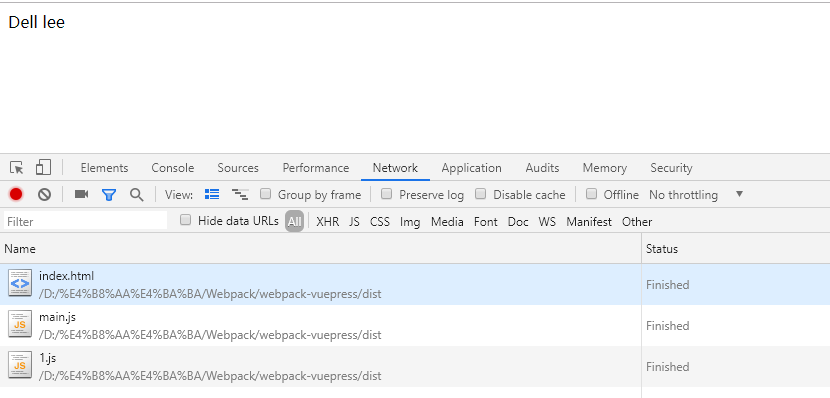
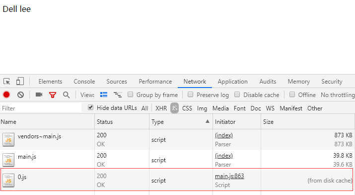
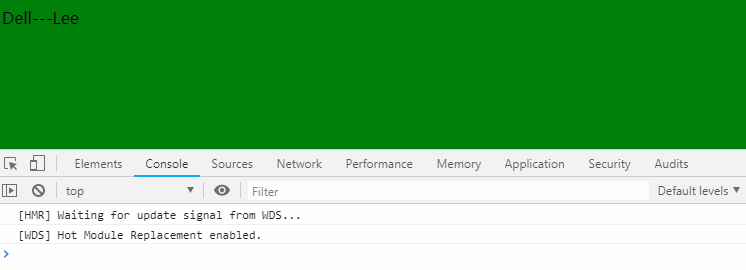

--- 
title: Webpack进阶
date: 2017-12-28
tags: 
 - webpack
categories:
  - webpack
---
# Webpack进阶

## Tree Shaking
::: tip 理解
`Tree Shaking`是一个术语，通常用于描述移除`js`中未使用的代码。
:::
::: warning 注意
Tree Shaking 只适用于`ES Module`语法(既通过`export`导出，`import`引入)，因为它依赖于`ES Module`的静态结构特性。
:::

在正式介绍`Tree Shaking`之前，我们需要现在`src`目录下新建一个`math.js`文件，它的代码如下：
```js
export function add(a, b) {
  console.log(a + b);
}
export function minus(a, b) {
  console.log(a - b);
}
```
接下来我们对`index.js`做一下处理，它的代码像下面这样，从`math.js`中引用`add`方法并调用：
```js
import { add } from './math'
add(1, 4);
```
在上面的`.js`改动完毕后，我们最后需要对`webpack.config.js`做一下配置，让它支持`Tree Shaking`，它的改动如下：
```js {8,9,10}
const path = require('path');
module.exports = {
  mode: 'development',
  devtool: 'source-map',
  entry: {
    main: './src/index.js'
  },
  optimization: {
    usedExports: true
  },
  output: {
    filename: 'main.js',
    path: path.resolve(__dirname,'dist')
  }
}
```
在以上`webpack.config.js`配置完毕后，我们需要使用`npx webpack`进行打包，它的打包结果如下：
```js
// dist/main.js
"use strict";
/* harmony export (binding) */ 
__webpack_require__.d(__webpack_exports__, "a", function() { return add; });
/* unused harmony export minus */
function add(a, b) {
  console.log(a + b);
}
function minus(a, b) {
  console.log(a - b);
}
```
**打包结果分析**：虽然我们配置了 `Tree Shaking`，但在开发环境下，我们依然能够看到未使用过的`minus`方法，以上注释也清晰了说明了这一点，这个时候你可能会问：为什么我们配置了`Tree Shaking`，`minus`方法也没有被使用，但依然还是被打包进了`main.js`中？<br/>

其实这个原因很简单，这是因为我们处于开发环境下打包，当我们处于开发环境下时，由于`source-map`等相关因素的影响，如果我们不把没有使用的代码一起打包进来的话，`source-map`就不是很准确，这会影响我们本地开发的效率。<br/>

看完以上本地开发`Tree Shaking`的结果，我们也知道了本地开发`Tree Shaking`相对来说是不起作用的，那么在生产环境下打包时，`Tree Shaking`的表现又如何呢？<br/>

在生产环境下打包，需要我们对`webpack.config.js`中的`mode`属性，需要由`development`改为`production`，它的改动如下：
``` js {3}
const path = require('path');
module.exports = {
  mode: 'production',
  devtool: 'source-map',
  entry: {
    main: './src/index.js'
  },
  optimization: {
    usedExports: true
  },
  output: {
    filename: 'main.js',
    path: path.resolve(__dirname,'dist')
  }
}
```
配置完毕后，我们依然使用`npx webpack`进行打包，可以看到，它的打包结果如下所示：
```js
// dist/main.js
([function(e,n,r){
  "use strict";
  var t,o;
  r.r(n),
  t=1,
  o=4,
  console.log(t+o)
}]);
```
**打包代码分析**：以上代码是一段被压缩过后的代码，我们可以看到，上面只有`add`方法，未使用的`minus`方法并没有被打包进来，这说明在生产环境下我们的`Tree Shaking`才能真正起作用。


#### SideEffects
::: tip 说明
由于`Tree Shaking`作用于所有通过`import`引入的文件，如果我们引入第三方库，例如：`import _ from 'lodash'`或者`.css`文件，例如`import './style.css'` 时，如果我们不
做限制的话，Tree Shaking将起副作用，`SideEffects`属性能帮我们解决这个问题：它告诉`webpack`，我们可以对哪些文件不做 `Tree Shaking`
:::
```js
// 修改package.json
// 如果不希望对任何文件进行此配置，可以设置sideEffects属性值为false
// *.css 表示 对所有css文件不做 Tree Shaking
// @babael/polyfill 表示 对@babel/polyfill不做 Tree Shaking
"sideEffects": [
  "*.css",
  "@babel/polyfill"
],
```

**小结**：对于`Tree Shaking`的争议比较多，推荐看:point_right:[你的Tree Shaking并没有什么卵用](https://zhuanlan.zhihu.com/p/32831172)，看完你会发现我们对`Tree Shaking`的了解太浅薄了:sob:

## 区分开发模式和生产模式
像上一节那样，如果我们要区分`Tree Shaking`的开发环境和生产环境，那么我们每次打包的都要去更改`webpack.config.js`文件，有没有什么办法能让我们少改一点代码呢？ 答案是有的！
::: tip 说明
区分开发环境和生产环境，最好的办法是把公用配置提取到一个配置文件，生产环境和开发环境只写自己需要的配置，在打包的时候再进行合并即可，**`webpack-merge`** 可以帮我们做到这个事情。
:::

首先，我们效仿各大框架的脚手架的形式，把 Webpack 相关的配置都放在根目录下的`build`文件夹下，所以我们需要新建一个`build`文件夹，随后我们要在此文件夹下新建三个`.js`文件和删除`webpack.config.js`，它们分别是：
* `webpack.common.js`：Webpack 公用配置文件
* `webpack.dev.js`：开发环境下的 Webpack 配置文件
* `webpack.prod.js`：生产环境下的 Webpack 配置文件
* `webpack.config.js`：**删除**根目录下的此文件

新建完`webpack.common.js`文件后，我们需要把公用配置提取出来，它的代码看起来应该是下面这样子的：
```js
const path = require('path');
const htmlWebpackPlugin = require('html-webpack-plugin');
const cleanWebpackPlugin = require('clean-webpack-plugin');
module.exports = {
  entry: {
    main: './src/index.js'
  },
  module: {
    rules: [
      {
        test: /\.css$/,
        use: ['style-loader','css-loader']
      },
      { 
        test: /\.js$/, 
        exclude: /node_modules/, 
        loader: "babel-loader" 
      }
    ]
  },
  plugins: [
    new htmlWebpackPlugin({
      template: 'src/index.html'
    }),
    new cleanWebpackPlugin()
  ],
  output: {
    filename: '[name].js',
    path: path.resolve(__dirname,'dist')
  }
}
```

提取完 Webpack 公用配置文件后，我们开发环境下的配置，也就是`webpack.dev.js`中的代码，将剩下下面这些：
```js
const webpack = require('webpack');
module.exports = {
  mode: 'development',
  devtool: 'cheap-module-eval-source-map',
  devServer: {
    contentBase: 'dist',
    open: true,
    port: 3000,
    hot: true,
    hotOnly: true
  },
  plugins: [
    new webpack.HotModuleReplacementPlugin()
  ]
}
```
而生产环境下的配置，也就是`webpack.prod.js`中的代码，可能是下面这样子的：
```js
module.exports = {
  mode: 'production',
  devtool: 'cheap-module-source-map',
  optimization: {
    usedExports: true
  }
}
```

在处理完以上三个`.js`文件后，我们需要做一件事情：
* 当处于开发环境下时，把`webpack.common.js`中的配置和`webpack.dev.js`中的配置合并在一起
* 当处于开发环境下时，把`webpack.common.js`中的配置和`webpack.prod.js`中的配置合并在一起

针对以上问题，我们可以使用`webpack-merge`进行合并，在使用之前，我们需要使用如下命令进行安装：
``` sh
$ npm install webpack-merge -D
```

安装完毕后，我们需要对`webpack.dev.js`和`webpack.prod.js`做一下手脚，其中`webpack.dev.js`中的改动如下(代码高亮部分)：
```js {2,3,4,18}
const webpack = require('webpack');
const merge = require('webpack-merge');
const commonConfig = require('./webpack.common');
const devConfig = {
  mode: 'development',
  devtool: 'cheap-module-eval-source-map',
  devServer: {
    contentBase: 'dist',
    open: true,
    port: 3000,
    hot: true,
    hotOnly: true
  },
  plugins: [
    new webpack.HotModuleReplacementPlugin()
  ]
}
module.exports = merge(commonConfig, devConfig);
```
相同的代码，`webpack.prod.js`中的改动部分如下(代码高亮)：
```js {1,2,3,10}
const merge = require('webpack-merge');
const commonConfig = require('./webpack.common');
const prodConfig = {
  mode: 'production',
  devtool: 'cheap-module-source-map',
  optimization: {
    usedExports: true
  }
}
module.exports = merge(commonConfig, prodConfig);
```
聪明的你一定想到了，因为上面我们已经删除了`webpack.config.js`文件，所以我们需要重新在`package.json`中配置一下我们的打包命令，它们是这样子写的：
``` json
"scripts": {
  "dev": "webpack-dev-server --config ./build/webpack.dev.js",
  "build": "webpack --config ./build/webpack.prod.js"
},
```

配置完打包命令，心急的你可能会马上开始尝试进行打包，你的打包目录可能长成下面这个样子：
```js
|-- build
|   |-- dist
|   |   |-- index.html
|   |   |-- main.js
|   |   |-- main.js.map
|   |-- webpack.common.js
|   |-- webpack.dev.js
|   |-- webpack.prod.js
|-- src
|   |-- index.html
|   |-- index.js
|   |-- math.js
|-- .babelrc
|-- postcss.config.js
|-- package.json
```
**问题分析**：当我们运行`npm run build`时，`dist`目录打包到了`build`文件夹下了，这是因为我们把Webpack 相关的配置放到了`build`文件夹下后，并没有做其他配置，Webpack 会认为`build`文件夹会是根目录，要解决这个问题，需要我们在`webpack.common.js`中修改`output`属性，具体改动的部分如下所示：
```json {3}
output: {
  filename: '[name].js',
  path: path.resolve(__dirname,'../dist')
}
```
那么解决完上面这个问题，赶紧使用你的打包命令测试一下吧，我的打包目录是下面这样子，如果你按上面的配置后，你的应该跟此目录类似
```js
|-- build
|   |-- webpack.common.js
|   |-- webpack.dev.js
|   |-- webpack.prod.js
|-- dist
|   |-- index.html
|   |-- main.js
|   |-- main.js.map
|-- src
|   |-- index.html
|   |-- index.js
|   |-- math.js
|-- .babelrc
|-- postcss.config.js
|-- package.json
```

## 代码分离(CodeSplitting)
::: tip 理解
`Code Splitting` 的核心是把很大的文件，分离成更小的块，让浏览器进行并行加载。
:::
常见的代码分割有三种形式：
* 手动进行分割：例如项目如果用到`lodash`，则把`lodash`单独打包成一个文件。
* 同步导入的代码：使用 Webpack 配置进行代码分割。
* 异步导入的代码：通过模块中的内联函数调用来分割代码。

#### 手动进行分割
手动进行分割的意思是在`entry`上配置多个入口，例如像下面这样：
``` js
module.exports = {
  entry: {
    main: './src/index.js',
    lodash: 'lodash'
  }
}
```
这样配置后，我们使用`npm run build`打包命令，它的打包输出结果为：
```
        Asset       Size  Chunks             Chunk Names
  index.html  462 bytes          [emitted]
    lodash.js   1.46 KiB       1  [emitted]  lodash
lodash.js.map   5.31 KiB       1  [emitted]  lodash
      main.js   1.56 KiB       2  [emitted]  main
  main.js.map   5.31 KiB       2  [emitted]  main
```
它输出了两个模块，也能在一定程度上进行代码分割，不过这种分割是十分脆弱的，如果两个模块共同引用了第三个模块，那么第三个模块会被同时打包进这两个入口文件中，而不是分离出来。<br/><br/>


所以我们常见的做法是关心最后两种代码分割方法，无论是同步代码还是异步代码，都需要在`webpack.common.js`中配置`splitChunks`属性，像下面这样子：
```js
module.exports = {
  // 其它配置
  optimization: {
    splitChunks: {
      chunks: 'all'
    }
  }
}
```
你可能已经看到了其中有一个`chunks`属性，它告诉 Webpack 应该对哪些模式进行打包，它的参数有三种：
* `async`：此值为默认值，只有异步导入的代码才会进行代码分割。
* `initial`：与`async`相对，只有同步引入的代码才会进行代码分割。
* `all`：表示无论是同步代码还是异步代码都会进行代码分割。

#### 同步代码分割
在完成上面的配置后，让我们来安装一个相对大一点的包，例如：`lodash`，然后对`index.js`中的代码做一些手脚，像下面这样：
```js
import _ from 'lodash'
console.log(_.join(['Dell','Lee'], ' '));
```
就像上面提到的那样，同步代码分割，我们只需要在`webpack.common.js`配置`chunks`属性值为`initial`即可：
``` js {5}
module.exports = {
  // 其它配置
  optimization: {
    splitChunks: {
      chunks: 'initial'
    }
  }
}
```
在`webpack.common.js`配置完毕后，我们使用`npm run build`来进行打包， 你的打包`dist`目录看起来应该像下面这样子：
```js
|-- dist
|   |-- index.html
|   |-- main.js
|   |-- main.js.map
|   |-- vendors~main.js
|   |-- vendors~main.js.map
```
**打包分析**：`main.js`使我们的业务代码，`vendors~main.js`是第三方模块的代码，在此案例中也就是`_lodash`中的代码。

#### 异步代码分割
由于`chunks`属性的默认值为`async`，如果我们只需要针对异步代码进行代码分割的话，我们只需要进行异步导入，Webpack会自动帮我们进行代码分割，异步代码分割它的配置如下：
```js {5}
module.exports = {
  // 其它配置
  optimization: {
    splitChunks: {
      chunks: 'async'
    }
  }
}
```
**注意**：由于异步导入语法目前并没有得到全面支持，需要通过 npm 安装 `@babel/plugin-syntax-dynamic-import` 插件来进行转译
``` sh
$ npm install @babel/plugin-syntax-dynamic-import -D
```
安装完毕后，我们需要在根目录下的`.babelrc`文件做一下改动，像下面这样子：
```json {6}
{
  "presets": [["@babel/preset-env", {
    "corejs": 2,
    "useBuiltIns": "usage"
  }]],
  "plugins": ["@babel/plugin-syntax-dynamic-import"]
}
```
配置完毕后，我们需要对`index.js`做一下代码改动，让它使用异步导入代码块:
```js
// 点击页面，异步导入lodash模块
document.addEventListener('click', () => {
  getComponent().then((element) => {
    document.getElementById('root').appendChild(element)
  })
})

function getComponent () {
  return import(/* webpackChunkName: 'lodash' */'lodash').then(({ default: _ }) => {
    var element = document.createElement('div');
    element.innerHTML = _.join(['Dell', 'lee'], ' ')
    return element;
  })
}
```
写好以上代码后，我们同样使用`npm run build`进行打包，`dist`打包目录的输出结果如下：
```js
|-- dist
|   |-- 1.js
|   |-- 1.js.map
|   |-- index.html
|   |-- main.js
|   |-- main.js.map
```
我们在浏览器中运行`dist`目录下的`index.html`，切换到`network`面板时，我们可以发现只加载了`main.js`，如下图：

<br/><br/>

当我们点击页面时，才 **真正开始加载** 第三方模块，如下图(`1.js`)：



## SplitChunksPlugin配置参数详解
在上一节中，我们配置了`splitChunks`属性，它能让我们进行代码分割，其实这是因为 Webpack 底层使用了 **`splitChunksPlugin`** 插件。这个插件有很多可以配置的属性，它也有一些默认的配置参数，它的默认配置参数如下所示，我们将在下面为一些常用的配置项做一些说明。
```js
module.exports = {
  // 其它配置项
  optimization: {
    splitChunks: {
      chunks: 'async',
      minSize: 30000,
      maxSize: 0,
      minChunks: 1,
      maxAsyncRequests: 5,
      maxInitialRequests: 3,
      automaticNameDelimiter: '~',
      name: true,
      cacheGroups: {
        vendors: {
          test: /[\\/]node_modules[\\/]/,
          priority: -10
        },
        default: {
          minChunks: 2,
          priority: -20,
          reuseExistingChunk: true
        }
      }
    }
  }
};
```

#### chunks参数
此参数的含义在上一节中已详细说明，同时也配置了相应的案例，就**不再次累述**。

#### minSize 和 maxSize
::: tip 说明
`minSize`默认值是30000，也就是30kb，当代码超过30kb时，才开始进行代码分割，小于30kb的则不会进行代码分割；与`minSize`相对的，`maxSize`默认值为0，为0表示不限制打包后文件的大小，一般这个属性不推荐设置，一定要设置的话，它的意思是：打包后的文件最大不能超过设定的值，超过的话就会进行代码分割。
:::
为了测试以上两个属性，我们来写一个小小的例子，在`src`目录下新建一个`math.js`文件，它的代码如下：
```js
export function add(a, b) {
  return a + b;
}
```
新建完毕后，在`index.js`中引入`math.js`:
```js
import { add } from './math.js'
console.log(add(1, 2));
```
**打包分析**：因为我们写的`math.js`文件的大小非常小，如果应用默认值，它是不会进行代码分割的，如果你要进一步测试`minSize`和`maxSize`，请自行修改后打包测试。

#### minChunks
::: tip 说明
默认值为1，表示某个模块复用的次数大于或等于一次，就进行代码分割。
:::
如果将其设置大于1，例如：`minChunks:2`，在不考虑其他模块的情况下，以下代码不会进行代码分割：
```js
// 配置了minChunks: 2，以下lodash不会进行代码分割，因为只使用了一次 
import _ from 'lodash';
console.log(_.join(['Dell', 'Lee'], '-'));
```


#### maxAsyncRequests 和 maxInitialRequests
* `maxAsyncRequests`：它的默认值是5，代表在进行异步代码分割时，前五个会进行代码分割，超过五个的不再进行代码分割。
* `maxInitialRequests`：它的默认值是3，代表在进行同步代码分割时，前三个会进行代码分割，超过三个的不再进行代码分割。

#### automaticNameDelimiter
这是一个连接符，左边是代码分割的缓存组，右边是打包的入口文件的项，例如`vendors~main.js`

#### cacheGroups
::: tip 说明
在进行代码分割时，会把符合条件的放在一组，然后把一组中的所有文件打包在一起，默认配置项中有两个分组，一个是`vendors`和`default`
:::

**vendors组：** 以下代码的含义是，将所有通过引用`node_modules`文件夹下的都放在`vendors`组中
```js
vendors: {
  test: /[\\/]node_modules[\\/]/,
  priority: -10
}
```
**default组：** 默认组，意思是，不符合`vendors`的分组都将分配在`default`组中，如果一个文件即满足`vendors`分组，又满足`default`分组，那么通过`priority`的值进行取舍，值最大**优先级**越高。
```js
default: {
  minChunks: 2,
  priority: -20,
  reuseExistingChunk: true
}
```

**reuseExistingChunk：** 中文解释是复用已存在的文件。意思是，如果有一个`a.js`文件，它里面引用了`b.js`，但我们其他模块又有引用`b.js`的地方。开启这个配置项后，在打包时会分析`b.js`已经打包过了，直接可以复用不用再次打包。
```js
// a.js
import b from 'b.js';
console.log('a.js');

// c.js
import b from 'b.js';
console.log('c.js');
```

## Lazy Loading懒加载
::: tip 理解
`Lazy Loading`懒加载的理解是：通过异步引入代码，它说的异步，并不是在页面一开始就加载，而是在合适的时机进行加载。
:::
`Lazy Loading`懒加载的实际案例我们已经在上一小节书写了一个例子，不过我们依然可以做一下小小的改动，让它使用`async/await`进行异步加载，它的代码如下：
```js
// 页面点击的时候才加载lodash模块
document.addEventListener('click', () => {
  getComponet().then(element => {
    document.body.appendChild(element);
  })
})
async function getComponet() {
  const { default: _ }  = await import(/* webpackChunkName: 'lodash' */ 'lodash');
  var element = document.createElement('div');
  element.innerHTML = _.join(['1', '2', '3'], '**')
  return element;
}
```
以上懒加载的结果与上一小节的结果类似，就不在此展示，你可以在你本地的项目中打包后自行测试和查看。

## PreLoading 和Prefetching
::: tip 理解
在以上`Lazy Loading`的例子中，只有当我们在页面点击时才会加载`lodash`，也有一些模块虽然是异步导入的，但我们希望能提前进行加载，`PreLoading`和`Prefetching`可以帮助我们实现这一点，它们的用法类似，但它们还是有区别的：`Prefetching`不会跟随主进程一些下载，而是等到主进程加载完毕，带宽释放后才进行加载，`PreLoading`会随主进程一起加载。
:::
实现`PreLoading`或者`Prefetching`非常简单，我们只需要在上一节的例子中加一点点代码即可(参考高亮部分)：
``` js {8}
// 页面点击的时候才加载lodash模块
document.addEventListener('click', () => {
  getComponet().then(element => {
    document.body.appendChild(element);
  })
})
async function getComponet() {
  const { default: _ }  = await import(/* webpackPrefetch: true */ 'lodash');
  var element = document.createElement('div');
  element.innerHTML = _.join(['1', '2', '3'], '**')
  return element;
}
```
改写完毕后，我们使用`npm run dev`或者`npm run build`进行打包，在浏览器中点击页面，我们将在`network`面板看到如下图所示：


相信聪明的你一定看到了`0.js`，它是`from disk cache`，那为什么？原因在于，`Prefetching`的代码它会在`head`头部，添加像这样的一段内容：
``` css
<link rel="prefetch" as="script" href="0.js">
```
这样一段内容追加到`head`头部后，指示浏览器在空闲时间里去加载`0.js`，这正是`Prefetching`它所能帮我们做到的事情，而`PreLoading`的用法于此类似，请自行测试。

## CSS代码分割
::: tip 理解
当我们在使用`style-loader`和`css-loader`打包`.css`文件时会直接把CSS文件打包进`.js`文件中，然后直接把样式通过`<style></style>`的方式写在页面，如果我们要把CSS单独打包在一起，然后通过`link`标签引入，那么可以使用`mini-css-extract-plugin`插件进行打包。
:::
::: warning
~~截止到写此文档时，此插件还未支持HMR，意味着我们要使用这个插件进行打包CSS时，为了开发效率，我们需要配置在生产环境下，开发环境依然还是使用`style-loader`进行打包~~。<br/>
**此插件的最新版已支持HMR**。
:::
在配置之前，我们需要使用`npm install`进行安装此插件：
``` sh
$ npm install mini-css-extract-plugin -D
```
安装完毕后，由于此插件已支持`HMR`，那我们可以把配置写在`webpack.common.js`中(以下配置为完整配置，改动参考高亮代码块)：
```js {4,15,16,17,18,19,36,37,38}
const path = require('path');
const htmlWebpackPlugin = require('html-webpack-plugin');
const cleanWebpackPlugin = require('clean-webpack-plugin');
const miniCssExtractPlugin = require('mini-css-extract-plugin');
module.exports = {
  entry: {
    main: './src/index.js'
  },
  module: {
    rules: [
      {
        test: /\.css$/,
        use: [
          { 
            loader: miniCssExtractPlugin.loader,
            options: {
              hmr: true,
              reloadAll: true
            }
          },
          'css-loader'
        ]
      },
      { 
        test: /\.js$/, 
        exclude: /node_modules/, 
        loader: "babel-loader" 
      }
    ]
  },
  plugins: [
    new htmlWebpackPlugin({
      template: 'src/index.html'
    }),
    new cleanWebpackPlugin(),
    new miniCssExtractPlugin({
      filename: '[name].css'
    })
  ],
  optimization: {
    splitChunks: {
      chunks: 'all'
    }
  },
  output: {
    filename: '[name].js',
    path: path.resolve(__dirname,'../dist')
  }
}
```
配置完毕以后，我们来在`src`目录下新建一个`style.css`文件，它的代码如下：
```css
body {
  color: green;
}
```
接下来，我们改动一下`index.js`文件，让它引入`style.css`，它的代码可以这样写：
```js
import './style.css';
var root = document.getElementById('root');
root.innerHTML = 'Hello,world'
```

使用`npm run build`进行打包，`dist`打包目录如下所示：
```js
|-- dist
|   |-- index.html
|   |-- main.css
|   |-- main.css.map
|   |-- main.js
|   |-- main.js.map
```
::: warning 注意
如果发现并没有打包生成`main.css`文件，可能是`Tree Shaking`的副作用，应该在`package.json`中添加属性`sideEffects:['*.css']`
:::

#### CSS压缩
::: tip 理解
`CSS`压缩的理解是：当我们有两个相同的样式分开写的时候，我们可以把它们合并在一起；为了减少`CSS`文件的体积，我们需要像压缩`JS`文件一样，压缩一下`CSS`文件。
:::
我们再在`src`目录下新建`style1.css`文件，内容如下：
```css
body{
  line-height: 100px;
}
```
在`index.js`文件中引入此CSS文件
```js
import './style.css';
import './style1.css';
var root = document.getElementById('root');
root.innerHTML = 'Hello,world'
```
使用打包`npm run build`打包命令，我们发现虽然插件帮我们把CSS打包在了一个文件，但并没有合并压缩。
```css
body {
  color: green;
}
body{
  line-height: 100px;
}
```
要实现`CSS`的压缩，我们需要再安装一个插件：
``` sh
$ npm install optimize-css-assets-webpack-plugin -D
```
安装完毕后我们需要再一次改写`webpack.common.js`的配置，如下：
```js {1,8,9,10}
const optimizaCssAssetsWebpackPlugin = require('optimize-css-assets-webpack-plugin');
module.exports = {
  // 其它配置
  optimization: {
    splitChunks: {
      chunks: 'all'
    },
    minimizer: [
      new optimizaCssAssetsWebpackPlugin()
    ]
  }
}
```
配置完毕以后，我们再次使用`npm run build`进行打包，打包结果如下所示，可以看见，两个CSS文件的代码已经压缩合并了。
```css
body{color:red;line-height:100px}
```

## Webpack和浏览器缓存(Caching)
在讲这一小节之前，让我们清理下项目目录，改写下我们的`index.js`，删除掉一些没用的文件：
```js
import _ from 'lodash';

var dom = document.createElement('div');
dom.innerHTML = _.join(['Dell', 'Lee'], '---');
document.body.append(dom);
```
清理后的项目目录可能是这样的：
```js
|-- build
|   |-- webpack.common.js
|   |-- webpack.dev.js
|   |-- webpack.prod.js
|-- src
    |-- index.html
    |-- index.js
|-- postcss.config.js
|-- package.json
```
我们使用`npm run build`打包命令，打包我们的代码，可能会生成如下的文件：
```js
|-- build
|   |-- webpack.common.js
|   |-- webpack.dev.js
|   |-- webpack.prod.js
|-- dist
|   |-- index.html
|   |-- main.js
|   |-- main.js.map
|   |-- vendors~main.js
|   |-- vendors~main.js.map
|-- src
    |-- index.html
    |-- index.js
|-- package.json
|-- postcss.config.js
```
我们可以看到，打包生成的`dist`目录下，文件名是`main.js`和`vendors~main.js`，如果我们把`dist`目录放在服务器部署的话，当用户第一次访问页面时，浏览器会自动把这两个`.js`文件缓存起来，下一次非强制性刷新页面时，会直接使用缓存起来的文件。<br/><br/>
假如，我们在用户第一次刷新页面和第二次刷新页面之间，我们修改了我们的代码，并再一次部署，这个时候由于浏览器缓存了这两个`.js`文件，所以用户界面无法获取最新的代码。<br><br/>
那么，我们有办法能解决这个问题呢，答案是`[contenthash]`占位符，它能根据文件的内容，在每一次打包时生成一个唯一的hash值，只要我们文件发生了变动，就重新生成一个hash值，没有改动的话，`[contenthash]`则不会发生变动，可以在`output`中进行配置，如下所示：
```js
// 开发环境下的output配置还是原来的那样，也就是webpack.common.js中的output配置
// 因为开发环境下，我们不用考虑缓存问题
// webpack.prod.js中添加output配置
output: {
  filename: '[name].[contenthash].js',
  chunkFilename: '[name].[contenthash].js'
}
```

使用`npm run build`进行打包，`dist`打包目录的结果如下所示，可以看到每一个`.js`文件都有一个唯一的`hash`值，这样配置后就能有效解决浏览器缓存的问题。
```js
|-- dist
|   |-- index.html
|   |-- main.8bef05e11ca1dc804836.js
|   |-- main.8bef05e11ca1dc804836.js.map
|   |-- vendors~main.4b711ce6ccdc861de436.js
|   |-- vendors~main.4b711ce6ccdc861de436.js.map
```

## Shimming
有时候我们在引入第三方库的时候，不得不处理一些全局变量的问题，例如jQuery的`$`，lodash的`_`，但由于一些老的第三方库不能直接修改它的代码，这时我们能不能定义一个全局变量，当文件中存在`$`或者`_`的时候自动的帮他们引入对应的包。
::: tip 解决办法
这个问题，可以使用`ProvidePlugin`插件来解决，这个插件已经被 Webpack 内置，无需安装，直接使用即可。
:::
在`src`目录下新建`jquery.ui.js`文件，代码如下所示，它使用了`jQuery`的`$`符号，创建这个文件目的是为了来模仿第三方库。
```js
export function UI() {
  $('body').css('background','green');
}
```
创建完毕后，我们修改一下`index.js`文件， 让它使用刚才我们创建的文件：
```js
import _ from 'lodash';
import $ from 'jquery';
import { UI } from './jquery.ui';

UI();

var dom = $(`<div>${_.join(['Dell', 'Lee'], '---')}</div>`);
$('#root').append(dom);
```

接下来我们使用`npm run dev`进行打包，它的结果如下：


**问题：** 我们发现，根本运行不起来，报错`$ is not defined`<br/>
**解答：** 这是因为虽然我们在`index.js`中引入的`jquery`文件，但`$`符号只能在`index.js`才有效，在`jquery.ui.js`无效，报错是因为`jquery.ui.js`中`$`符号找不到引起的。<br/>

以上场景完美再现了我们最开始提到的问题，那么我们接下来就通过配置解决，首先在`webpack.common.js`文件中使用`ProvidePlugin`插件：
::: tip 说明
配置`$:'jquery'`，只要我们文件中使用了`$`符号，它就会自动帮我们引入`jquery`，相当于`import $ from 'jquery'`
:::
```js {3,13,14,15,16}
const webpack = require('webpack');
module.exports = {
  // 其它配置
  plugins: [
    new webpack.ProvidePlugin({
      $: 'jquery',
      _: 'lodash'
    })
  ]
}
```

**打包结果：** 使用`npm run dev`进行打包，打包结果如下，可以发现，项目已经可以正确运行了。


## 处理全局this指向问题
我们现在来思考一个问题，一个模块中的`this`到底指向什么，是模块自身还是全局的`window`对象
```js
// index.js代码，在浏览器中输出：false
console.log(this===window);
```
如上所示，如果我们使用`npm run dev`运行项目，运行`index.html`时，会在浏览器的`console`面板输出`false`，证明在模块中`this`指向模块自身，而不是全局的`window`对象，那么我们有什么办法来解决这个问题呢？
::: tip 解决办法
安装使用`imports-loader`来解决这个问题
:::
``` sh
$ npm install imports-loader -D
```
安装完毕后，我们在`webpack.common.js`加一点配置，在`.js`的loader处理中，添加`imports-loader`
```js {13}
module.exports = {
  // ... 其它配置
  module: {
    rules: [
      { 
        test: /\.js$/, 
        exclude: /node_modules/, 
        use: [
          {
            loader: 'babel-loader'
          },
          {
            loader: 'imports-loader?this=>window'
          }
        ]
      }
    ]
  }
}
```
配置完毕后使用`npm run dev`来进行打包，查看`console`控制台输出`true`，证明`this`这个时候已经指向了全局`window`对象，问题解决。


