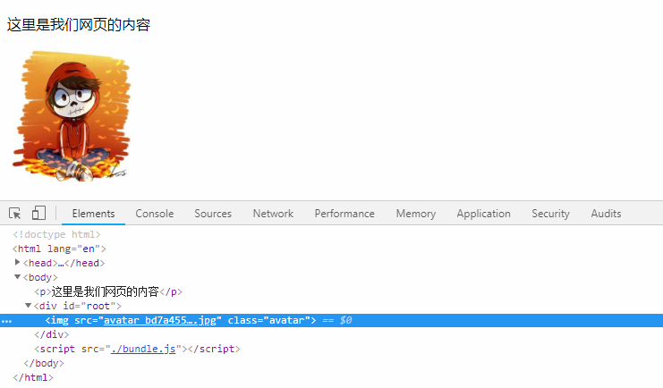

--- 
title: 打包静态资源
date: 2019/3/21
tags: 
 - webpack
categories:
  - webpack
---
# 打包静态资源

## 什么是loader？
::: tip 概念
`loader`是一种打包规则，它告诉了 Webpack 在遇到非`.js`文件时，应该如何处理这些文件
:::
`loader`有如下几种固定的运用规则：
* 使用`test`正则来匹配相应的文件
* 使用`use`来添加文件对应的`loader`
* 对于多个`loader`而言，从 **右到左** 依次调用


## 使用loader打包图片
::: tip 安装依赖
打包图片需要用到`file-loader`或者`url-loader`，需使用`npm install`进行安装
:::

#### 一点小改动
在打包图片之前，让我们把`index.html`移动到上一节打包后的`dist`目录下，`index.html`中相应的`.js`引入也需要修改一下，像下面这样
```html
<script src="./main.js"></script>
```

#### 添加打包图片规则
对于打包图片，我们需要在`webpack.config.js`中进行相应的配置，它可以像下面这样
```js
// path为Node的核心模块
const path = require('path');

module.exports = {
  // 其它配置
  module: {
    rules: [
      {
        test: /\.(png|jpg|gif)$/,
        use: {
          loader: 'file-loader'
        }
      }
    ]
  }
}
```
#### 改写`index.js`
```js
import avatar from './avatar.jpg'

var root = document.getElementById('root');
var img = document.createElement('img');
img.src = avatar
root.appendChild(img)
```
#### 打包后的项目目录
```js
|-- dist
|   |-- bd7a45571e4b5ccb8e7c33b7ce27070a.jpg
|   |-- main.js
|   |-- index.html
|-- index.js
|-- avatar.jpg
|-- package.json
|-- webpack.config.js
```
#### 打包结果


#### 运用占位符
在以上打包图片的过程中，我们发现打包生成的图片好像名字是一串乱码，如果我们要原样输出原图片的名字的话，又该如何进行配置呢？这个问题，可以使用 **占位符** 进行解决。
::: tip 占位符说明
文件占位符它有一些固定的规则，像下面这样：
* `[name]`代表原本文件的名字
* `[ext]`代表原本文件的后缀
* `[hash]`代表一个`md5`的唯一编码
:::
根据占位符的规则再次改写`webpack.config.js`文件，
```js
// path为Node的核心模块
const path = require('path');

module.exports = {
  // 其它配置
  module: {
    rules: [
      {
        test: /\.(png|jpg|gif)$/,
        use: {
          loader: 'file-loader',
          options: {
            name: '[name]_[hash].[ext]'
          }
        }
      }
    ]
  }
}
```
根据上面占位符的运用，打包生成的图片，它的名字如下
```sh
|-- dist
|   |-- avatar_bd7a45571e4b5ccb8e7c33b7ce27070a.jpg
```


## 使用loader打包CSS
::: tip 打包说明
样式文件分为几种情况，每一种都需要不同的`loader`来处理：
1. 普通`.css`文件，使用`style-loader`和`css-loader`来处理
2. `.less`文件，使用`less-loader`来处理
3. `.sass或者.scss`文件，需要使用`sass-loader`来处理
4. `.styl`文件，需要使用`stylus-loader`来处理
:::


#### 打包css文件
::: tip 安装依赖
首先安装`style-loader`和`css-loader`
:::
改写webpack配置文件：
```js
// path为Node的核心模块
const path = require('path');

module.exports = {
  // 其它配置
  module: {
    rules: [
      {
        test: /\.(png|jpg|gif)$/,
        use: {
          loader: 'file-loader',
          options: {
            name: '[name]_[hash].[ext]'
          }
        }
      },
      {
        test: /\.css$/,
        use: ['style-loader', 'css-loader']
      }
    ]
  }
}
```
根目录下创建`index.css`
```css
.avatar{
  width: 150px;
  height: 150px;
}
```
改写`index.js`文件
```js
import avatar from './avatar.jpg';
import './index.css';

var root = document.getElementById('root');
var img = new Image();
img.src = avatar;
img.classList.add('avatar');
root.appendChild(img);
```

**打包结果**



#### 打包Sass文件
::: tip 安装依赖
需要安装`sass-loader`和`node-sass`
:::

改写`webpack.config.js`文件
```js
// path为Node的核心模块
const path = require('path');

module.exports = {
  // 其它配置
  module: {
    rules: [
      {
        test: /\.(png|jpg|gif)$/,
        use: {
          loader: 'file-loader',
          options: {
            name: '[name]_[hash].[ext]'
          }
        }
      },
      {
        test: /\.css$/,
        use: ['style-loader', 'css-loader']
      },
      {
        test: /\.(sass|scss)$/,
        use: ['style-loader','css-loader','sass-loader']
      }
    ]
  }
}
```
根目录下添加`index-sass.sass`文件
```scss
body{
  .avatar-sass{
    width: 150px;
    height: 150px;
  }
}
```

改写`index.js`
```js
import avatar from './avatar.jpg';
import './index.css';
import './index-sass.sass';

var img = new Image();
img.src = avatar;
img.classList.add('avatar-sass');

var root = document.getElementById('root');
root.appendChild(img);
```

根据上面的配置和代码改写后，再次打包，打包的结果会是下面这个样子


#### 自动添加CSS厂商前缀
当我们在`css`文件中写一些需要处理兼容性的样式的时候，需要我们分别对于不同的浏览器书添加不同的厂商前缀，使用`postcss-loader`可以帮我们在`webpack`打包的时候自动添加这些厂商前缀。
::: tip 安装依赖
自动添加厂商前缀需要`npm install`安装`postcss-loader`和`autoprefixer`
:::
```sh
npm install postcss-loader autoprefixer -D
```
修改`index-sass.sass`
```css
.avatar-sass {
  width: 150px;
  height: 150px;
  transform: translate(50px,50px);
}
```

在修改`sass`文件代码后，我们需要对`webpack.config.js`
```json {23}
// path为Node的核心模块
const path = require('path');

module.exports = {
  // 其它配置
  module: {
    rules: [
      {
        test: /\.(png|jpg|gif)$/,
        use: {
          loader: 'file-loader',
          options: {
            name: '[name]_[hash].[ext]'
          }
        }
      },
      {
        test: /\.css$/,
        use: ['style-loader', 'css-loader']
      },
      {
        test: /\.(sass|scss)$/,
        use: ['style-loader','css-loader','sass-loader','postcss-loader']
      }
    ]
  }
}
```
根目录下添加`postcss.config.js`，并添加代码
```js
module.exports = {
  plugins: [require('autoprefixer')]
}
```

根据上面的配置，我们再次打包运行，在浏览器中运行`index.html`，它的结果如下图所示


#### 模块化打包CSS文件
::: tip 概念
`CSS`的模块化打包的理解是：除非我主动引用你的样式，否则你打包的样式不能影响到我。
:::
根目录下添加`createAvatar.js`文件，并填写下面这段代码
```js
import avatar from './avatar.jpg';
export default function CreateAvatar() {
  var img = new Image();
  img.src = avatar;
  img.classList.add('avatar-sass');

  var root = document.getElementById('root');
  root.appendChild(img);
}
```

改写`index.js`，引入`createAvatar.js`并调用
```js {2,6}
import avatar from './avatar.jpg';
import createAvatar from './createAvatar';
import './index.css';
import './index-sass.sass';

createAvatar();

var img = new Image();
img.src = avatar;
img.classList.add('avatar-sass');

var root = document.getElementById('root');
root.appendChild(img);
```

**打包运行**


我们可以看到，在`createAvatar.js`中，我们写的`img`标签的样式，它受`index-sass.sass`样式文件的影响，如果要消除这种影响，需要我们开启对`css`样式文件的模块化打包。

进一步改写`webpack.config.js`
```js {22}
// path为Node的核心模块
const path = require('path');

module.exports = {
  // 其它配置
  module: {
    rules: [
      {
        test: /\.(png|jpg|gif)$/,
        use: {
          loader: 'file-loader',
          options: {
            name: '[name]_[hash].[ext]'
          }
        }
      },
      {
        test: /\.(sass|scss)$/,
        use: ['style-loader', {
          loader: 'css-loader',
          options: {
            modules: true
          }
        }, 'sass-loader', 'postcss-loader']
      }
    ]
  }
}
```
开启`css`模块化打包后，我们需要在`index.js`中做一点小小的改动，像下面这样子
```js {4,10}
import avatar from './avatar.jpg';
import createAvatar from './createAvatar';
import './index.css';
import style from  './index-sass.sass';

createAvatar();

var img = new Image();
img.src = avatar;
img.classList.add(style['avatar-sass']);

var root = document.getElementById('root');
root.appendChild(img);
```

打包运行后，我们发现使用`createAvatar.js`创建出来的`img`没有受到样式文件的影响，证明我们的`css`模块化配置已经生效，下图是`css`模块化打包的结果：

